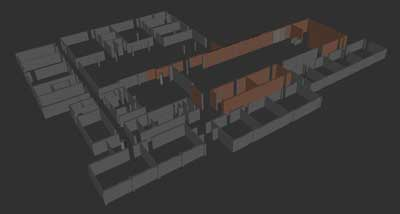
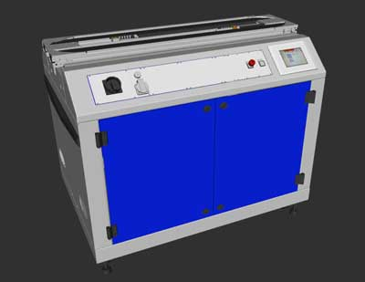
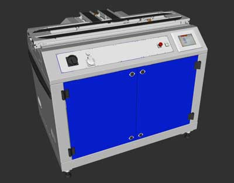
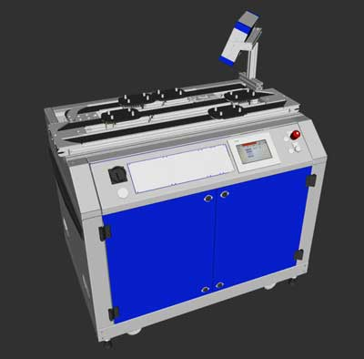
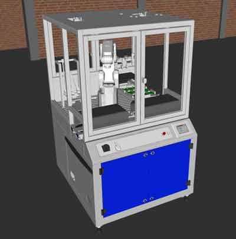

# AAU Lab 3D models for ROS #

AAU Lab 3D models for ROS.

* Fib14 lab
* Festo straight module
* Festo T-module
* Festo bypass module
* Festo robot module
* Festo pallet and product

## Current models
---
Example that visualizes the lab and models:
```sh
$ roslaunch aau_lab_ros_models view_model_rviz.launch
```

All model are attached to a link called `world_interface`, so all models can easily be moved at once together.

```xml
<!-- world and world_interface links -->
<link name="world" />
<link name="world_interface"/>

<!-- Joint between world and world_interface -->
<joint name="world_interface_to_world" type="fixed">
    <parent link="world" />
    <child link="world_interface" />
</joint>
```

### Fib14 building
---


```xml
<!-- Fib14 -->
<xacro:include filename="$(find aau_lab_ros_models)/urdf/fib14/fib14.urdf.xacro"/>
<xacro:fib14_urdf fib14_parent="world_interface"/>
```

### Festo Straight Module
---


```xml
<!-- Festo straight module -->
<xacro:include filename="$(find aau_lab_ros_models)/urdf/festo_straight_module/festo_straight_module.urdf.xacro"/>
<xacro:festo_module_urdf module_prefix="module4_" festo_module_parent="world_interface">
    <origin xyz="0.0 6.6 0.0" rpy="0 0 0.0"/>
</xacro:festo_module_urdf>
```

### Festo T-Module
---


```xml
<!-- Festo t-module -->
<xacro:include filename="$(find aau_lab_ros_models)/urdf/festo_t_module/festo_t_module.urdf.xacro"/>
<xacro:festo_module_urdf module_prefix="module2_" festo_module_parent="world_interface">
    <origin xyz="0.0 4.2 0.0" rpy="0 0 0.0"/>
</xacro:festo_module_urdf>

```

### Festo Bypass Module
---


```xml
<!-- Festo bypass module -->
<xacro:include filename="$(find aau_lab_ros_models)/urdf/festo_bypass_module/festo_bypass_module.urdf.xacro"/>
<xacro:festo_module_urdf module_prefix="module7_" festo_module_parent="world_interface">
    <origin xyz="-2.22 4.2 0.0" rpy="0 0 ${pi/2.0}"/>
</xacro:festo_module_urdf>
```

### Festo Robot Module
---


```xml
<!-- Festo robot module -->
<xacro:include filename="$(find aau_lab_ros_models)/urdf/festo_robot_module/festo_robot_module.urdf.xacro"/>
<xacro:festo_module_urdf module_prefix="module3_" festo_module_parent="world_interface">
    <origin xyz="0.0 5.4 0.0" rpy="0 0 0.0"/>
</xacro:festo_module_urdf>
```

### Festo Pallet and Product (todo)
---

## Additional models for Gazebo
---
You can find more 3D models at the following links. They are set up for use in Gazebo SDF-files, but the CAD-files and textures can be adapted to URDF/XACRO-files for use in ROS.

* https://app.ignitionrobotics.org/fuel/models
* https://github.com/osrf/gazebo_models
* http://data.nvision2.eecs.yorku.ca/3DGEMS/

---
## Who do I talk to? ###
* Simon Bøgh ([sb@mp.aau.dk](mailto:sb@mp.aau.dk))
